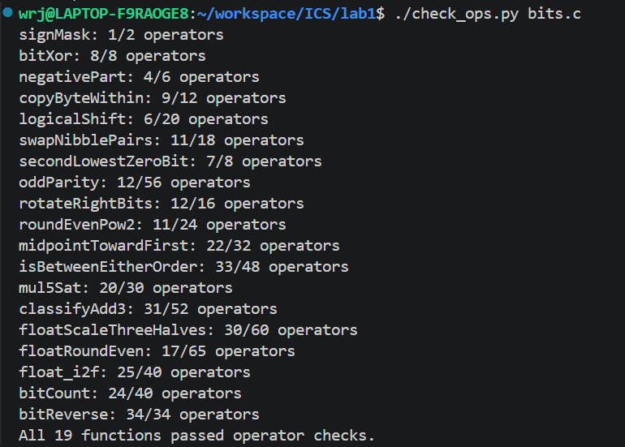
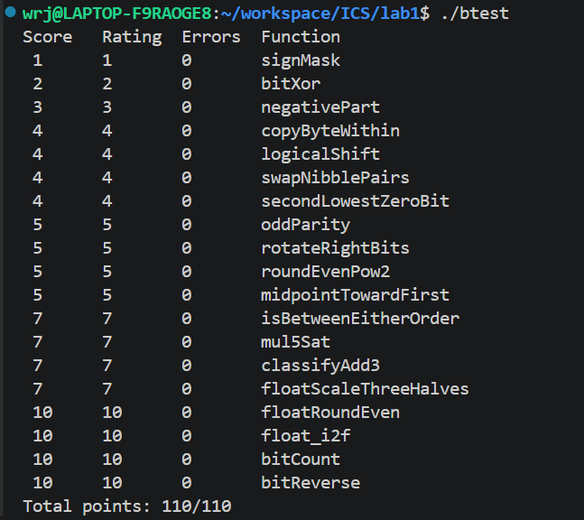

# Lab1：DataLab 实验报告

- 姓名：**吴睿杰**
- 学号：**25303050022**

## 一、规则检查与正确性测试

### 1. 运算符与操作数检查

检查命令：`./check_ops.py bits.c`。

显示 19 个函数均符合运算符与操作数限制，并出现 `All 19 functions passed operator checks.`。

### 2. 正确性测试

在最终代码重新编译后执行 `./btest`。各题 `Errors` 为 0，总分为 `Total points: 110/110`。

## 二、各题实现思路

### P1：`signMask`

将常量 `1` 左移 31 位，得到只有最高位为 1 的掩码 `0x80000000`，其余位均为 0。

### P2：`bitXor`

分别用 `x & ~y` 和 `~x & y` 找出两种“对应位不同”的情况，再利用德摩根律合并。整个表达式仅使用 `~` 与 `&`，满足本题的特殊限制。

### P3：`negativePart`

用 `x >> 31` 生成符号掩码：负数得到全 1，非负数得到全 0。将补码取负结果 `~x + 1` 与掩码相与，负数保留取负结果，其余返回 0；`INT_MIN` 按实验的 32 位模型处理，结果仍为 `0x80000000`。

### P4：`copyByteWithin`

将字节编号左移 3 位换算为位偏移，右移并与 `0xFF` 相与提取源字节。用目的字节掩码清除原目的字节，再将源字节移到目的位置并按位或合并，其他字节保持原样。

### P5：`logicalShift`

先对 `x` 做算术右移，再与 `~(((1 << 31) >> n) << 1)` 相与，清除高位补入的符号位。`n = 0` 时该掩码为全 1，`n = 31` 时仅保留最低位，移位量始终在合法范围内。

### P6：`swapNibblePairs`

由 `0x0F` 扩展构造 `0x0F0F0F0F`，分别取出每个字节的低、高半字节。低半字节左移 4 位，高半字节右移 4 位并再次用掩码过滤，最后按位或合并，从而交换各字节内的两个半字节。

### P7：`secondLowestZeroBit`

先令 `y = ~x`，将原来的 0 位转为 1 位。用 `y & (y + ~0)` 清除最低的一个 1，再用 `rest & (~rest + 1)` 提取剩余最低的 1，即原数第二低的 0 位；不足两个 0 位时返回 0。

### P8：`oddParity`

依次将当前值与其右移 16、8、4、2、1 位的结果异或，把全部 32 位的奇偶信息折叠到最低位。最低位为 1 表示原数中 1 的个数为奇数，因此用 `!(x & 1)` 取反，实现“偶数个 1 返回 1，奇数个 1 返回 0”。

### P9：`rotateRightBits`

用 `n & 31` 将循环移位量归约到 0–31。利用 P5 的掩码方法得到逻辑右移部分，再与左移 `(~k + 1) & 31` 位的部分合并；当 `k = 0` 时两部分都等于原数，避免了移位 32 位的问题。

### P10：`roundEvenPow2`

令 `half` 为 2 的 `n-1` 次幂，构造偏置 `half - 1 + ((x >> n) & 1)`，加上偏置后右移再左移，清除低 `n` 位。偏置结合商的奇偶性处理恰好半程的情况：商为偶数时向下舍入，为奇数时向上舍入，使最终商为偶数。

### P11：`midpointTowardFirst`

用 `(x & y) + ((x ^ y) >> 1)` 得到向下取整的中点，避免直接计算 `x + y` 溢出。异号时根据符号判断大小，同号时根据差值符号判断 `x` 是否不小于 `y`；若 `(x ^ y) & 1` 表明中点恰在两个整数之间，且 `x` 位于较大一侧，就给中点加 1，实现朝第一个参数取整。两参数相等时奇偶修正为 0。

### P12：`isBetweenEitherOrder`

分别计算 `x >= a` 和 `x >= b`：异号时看 `x` 的符号，同号时看差值的符号，避免异号相减造成错误。两种判断结果不同，表示 `x` 已跨过一个端点但尚未跨过另一个端点；再补上与任一端点相等的情况，实现端点顺序任意且包含边界的区间判断。

### P13：`mul5Sat`

依次相加得到 `2x`、`4x` 和 `5x`。前两步检查倍增前后的符号是否改变，最后一步检查同号相加后结果是否变号，合并得到溢出掩码；溢出时按原数符号选取 `INT_MAX` 或 `INT_MIN`，否则保留 `5x` 的结果。

### P14：`classifyAdd3`

先计算低 32 位结果 `s = x + y`、`t = s + z`，并通过位运算分别提取两次加法的无符号最高位进位。将三个输入的符号扩展值与这两次进位相加，得到精确数学和在低 32 位之外的高位值 `high`。若该值等于 `t >> 31`，说明精确和能够用 32 位有符号整数表示；否则根据差值 `high - (t >> 31)` 的符号返回正溢出 `1` 或负溢出 `-1`，没有溢出则返回 `0`。

### P15：`floatScaleThreeHalves`

拆出符号、阶码和尾数，NaN 与无穷大直接返回原位模式。非规格化数用尾数乘 3 再右移 1 位，并在恰好半程且保留结果为奇数时进位；结果越过规格化边界时，其位模式会自然形成阶码 1。规格化数补上隐藏位后乘 3，根据最高位选择右移 1 位或 2 位并调整阶码，再依据被丢弃部分进行最近偶数舍入；处理舍入进位和阶码溢出，保留符号及正负零。

### P16：`floatRoundEven`

按阶码分情况处理：NaN 和无穷大保持原样；绝对值小于 0.5 时返回带原符号的零；恰为 0.5 时舍入到零，大于 0.5 且小于 1 时舍入到带原符号的 1。阶码不小于 150 的有限数已经没有小数位，直接返回；其余情况清除小数对应的尾数位，比较被清除部分与半程，并结合保留整数的最低位决定是否进位，实现中点取偶。

### P17：`float_i2f`

零单独返回，其他输入先取得符号和无符号绝对值；负数用 `~x + 1u` 求幅值，使 `INT_MIN` 也能正确处理。找到最高有效位后确定阶码，并将有效位对齐到 24 位；需要右移时根据余数、半程和保留部分的最低位进行最近偶数舍入，若进位扩展为 25 位则再次右移并增加阶码，最后拼接浮点编码。

### P18：`bitCount`

构造 `0x55555555`、`0x33333333` 和 `0x0F0F0F0F`，逐级统计每 2 位、4 位和 8 位中的 1 的个数。再通过右移 8 位、16 位并相加汇总各字节，最后与 `0x3F` 相与，提取范围为 0–32 的总数。

### P19：`bitReverse`

先构造字节掩码 `0x00FF00FF`，再利用掩码与其左移结果的异或，依次得到半字节、2 位和 1 位掩码，复用已有掩码减少构造开销。随后依次交换相邻的 1 位、2 位、4 位和 8 位组，最后交换两个 16 位半字；右移部分均用对应掩码过滤，完成全部 32 位的镜像反转。

## 三、参考资料

1. [课程 Lab1：DataLab 页面](https://ics-26fall-fdu.github.io/labs/lab1-data-lab/)
2. [课程 DataLab 仓库的 README.md](https://github.com/ICS-26Fall-FDU/DataLab/blob/main/README.md) 与 [bits.c 题目说明](https://github.com/ICS-26Fall-FDU/DataLab/blob/main/bits.c)
